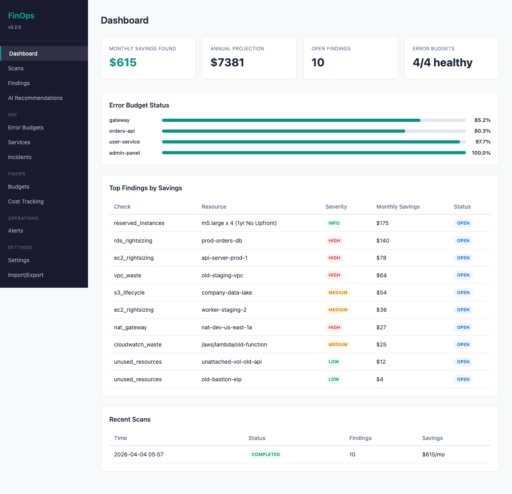
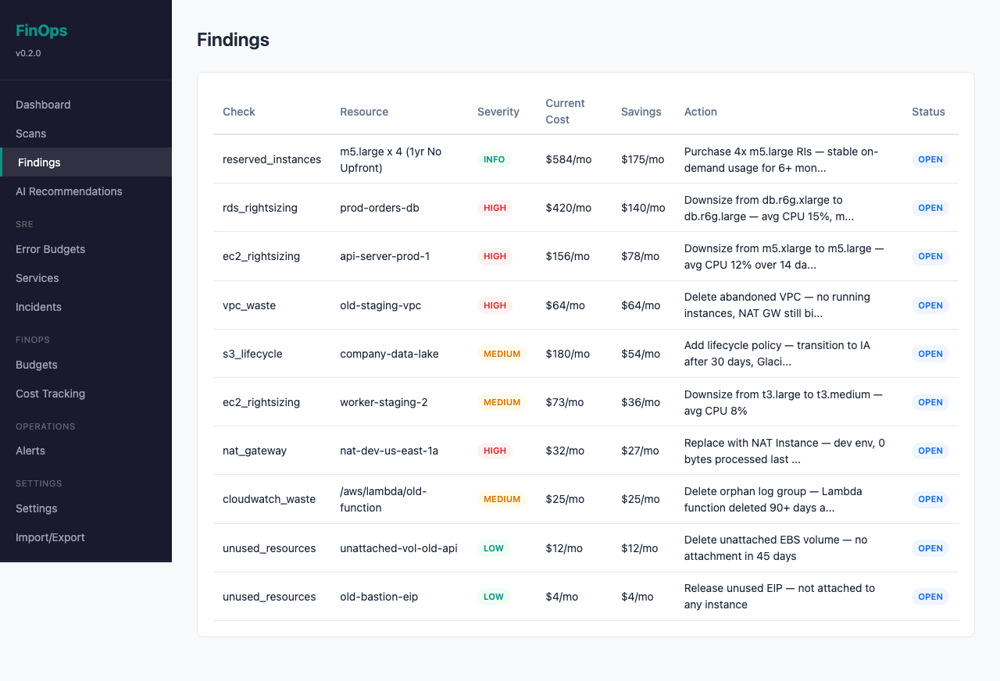
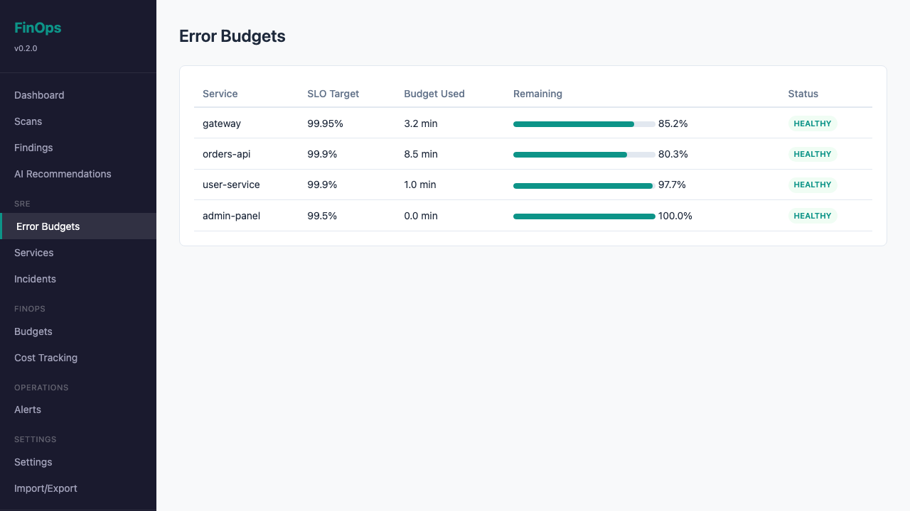
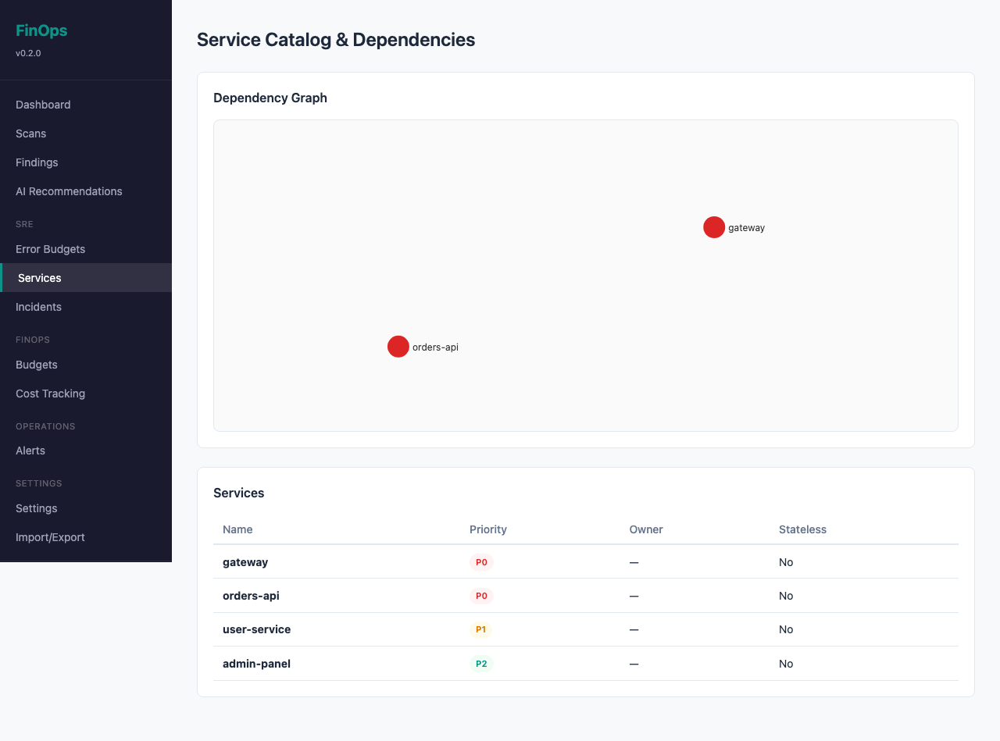

# aws-finops-toolkit

**SRE + FinOps Platform — cost optimization gated on error budgets, traffic analysis, and dependency safety.**

CLI + web dashboard that finds AWS waste with an SRE mindset: it checks your SLOs, error budgets, and service dependencies *before* recommending any cost cut. Built from real-world FinOps work that found $67K/year in savings across 4 AWS accounts — without a single production incident.

---

## Why This Exists

Most FinOps tools tell you *what* to cut. They don't tell you *if it's safe*.

No existing tool combines SRE reliability (error budgets, SLOs) with cost optimization. Sedai is autonomous but opaque. Harness CCM has budgets but no error budget gating. This fills the gap.

**Every recommendation passes a 5-step safety analysis:**

1. **Traffic Analysis** — 1-year traffic patterns, seasonal peaks, growth trends
2. **Dependency Check** — what services break if this resource fails? Blast radius?
3. **Error Budget Gate** — if error budget < 50%, all optimizations are blocked
4. **AI Analysis** — LLM explains risk, suggests timing, provides rollback plan
5. **User Confirmation** — checklist approval before any action

## Quick Start

```bash
# Install
pip install aws-finops-toolkit[web]

# Launch dashboard with demo data (no AWS creds needed)
finops dashboard --demo

# Or scan real AWS accounts
finops scan --profile production
```

Open `http://localhost:8080` to see the dashboard.

## Screenshots

### Dashboard — Cost overview, error budget status, top findings


### Findings — Filterable table with severity, savings, and inline actions


### Error Budgets — SLO targets with burn rate tracking per service


### Services — Service catalog with D3.js dependency graph


## Features

### Web Dashboard (HTMX + Chart.js)
- **Cost dashboard** — before/after comparison, trends, per-account breakdown
- **Findings** — filterable table with severity, accept/dismiss/watch actions
- **Error budget tracking** — set SLO targets, track burn rate, incident timeline
- **Financial budgets** — budget vs actual, forecast, AI advice
- **Service dependency graph** — D3.js interactive visualization
- **AI recommendations** — pluggable LLM (Claude/OpenAI) with safety analysis
- **Incident tracking** — record incidents, track user churn impact

### CLI (preserved from v0.1)
```bash
finops scan --profile prod                    # Scan AWS account
finops scan --profiles dev,staging,prod       # Multi-account scan
finops preflight --target prod-orders-db      # Pre-flight safety check
finops report --format html --output report.html
finops dashboard                              # Launch web UI
finops dashboard --demo                       # Demo mode (no AWS creds)
```

### 10 Cost Checks
| Check | What It Finds |
|-------|--------------|
| `ec2_rightsizing` | Over-provisioned instances (avg CPU < 20% over 14 days) |
| `nat_gateway` | NAT Gateways in dev/staging with 0 bytes processed |
| `spot_candidates` | Non-prod workloads eligible for Spot instances |
| `unused_resources` | Unattached EBS, unused EIPs, old snapshots, idle ALBs |
| `reserved_instances` | On-demand instances that should be RIs |
| `elasticache_scheduling` | Dev/staging clusters running 24/7 |
| `rds_rightsizing` | Over-provisioned databases, non-prod Multi-AZ |
| `vpc_waste` | Abandoned VPCs, idle NAT GWs, stale WorkSpaces |
| `cloudwatch_waste` | Orphan log groups, infinite retention, high ingestion |
| `s3_lifecycle` | S3 buckets without lifecycle policies |

### Multi-Cloud Ready
- **AWS** — full implementation (10 checks, Cost Explorer, CloudWatch)
- **Azure** — provider abstraction ready (Phase 2)
- **GCP** — provider abstraction ready (Phase 2)

### Pluggable AI
Bring your own LLM API key:
```yaml
# finops.yaml
llm:
  provider: claude    # or 'openai'
  api_key_env: ANTHROPIC_API_KEY
```

## Architecture

```
Browser (HTMX + Chart.js + D3.js)
    │
FastAPI Application
    ├── HTMX Pages (11 server-rendered pages)
    ├── REST API (/api/v1/* — 23+ endpoints)
    ├── SSE Events (async scan progress)
    │
    ├── Service Layer
    │   ├── ScannerService      — async scan orchestration
    │   ├── ErrorBudgetService  — SLO tracking + burn rate
    │   ├── BudgetService       — financial budget + forecast
    │   ├── CostService         — trends, comparison
    │   ├── SafetyAnalyzer      — traffic + deps + error budget gate
    │   └── AI Recommendations  — pluggable LLM (Claude/OpenAI)
    │
    ├── Provider Layer (pluggable)
    │   ├── AWS (boto3)
    │   ├── Azure (stub)
    │   └── GCP (stub)
    │
    └── SQLite (aiosqlite) — 16 tables, zero setup
```

## Tech Stack

| Component | Technology |
|-----------|-----------|
| Backend | Python 3.9+, FastAPI, uvicorn |
| Frontend | Jinja2, HTMX, Chart.js, D3.js |
| Database | SQLite (aiosqlite) — zero config |
| Cloud | boto3 (AWS) |
| AI | Anthropic Claude / OpenAI (pluggable) |
| CLI | Click + Rich |
| Testing | pytest + moto |

## Configuration

```yaml
# finops.yaml
accounts:
  - profile: production
    name: Production
  - profile: staging
    name: Staging

thresholds:
  ec2_cpu_avg_percent: 20
  snapshot_age_days: 90

web:
  host: 127.0.0.1
  port: 8080

llm:
  provider: claude
  api_key_env: ANTHROPIC_API_KEY

database:
  path: ~/.finops/finops.db
```

## API

Full OpenAPI docs available at `http://localhost:8080/docs` when running.

Key endpoints:
```
GET  /api/v1/health                    Health check
POST /api/v1/accounts                  Add cloud account
POST /api/v1/scans                     Trigger scan
GET  /api/v1/findings                  List findings (filterable)
POST /api/v1/error-budgets             Set SLO target
GET  /api/v1/costs/overview            Cost summary
POST /api/v1/ai/analyze                Run AI analysis
GET  /api/v1/services/dependency-graph D3.js graph data
POST /api/v1/incidents                 Record incident + user impact
```

## Development

```bash
git clone https://github.com/junegu/aws-finops-toolkit.git
cd aws-finops-toolkit
python -m venv .venv && source .venv/bin/activate
pip install -e ".[dev,web]"
pytest
```

## Blog Series

This tool is the companion code for the **"FinOps for SREs"** article series:

- [Part 1: How I Found $12K/Year in AWS Waste](https://medium.com/@junegu)
- Part 0: Pre-Flight: 9 Checks Before Cutting Costs
- Part 2: Downsizing Without Downtime

Read the full series on [Medium](https://medium.com/@junegu).

## License

MIT

## Author

**June Gu** — Site Reliability Engineer at NAVER Corporation (Placen). Ex-Coupang.

Building reliable infrastructure at scale. Relocating to Canada.

- [LinkedIn](https://linkedin.com/in/junegu)
- [Medium](https://medium.com/@junegu)
- [GitHub](https://github.com/junegu)
